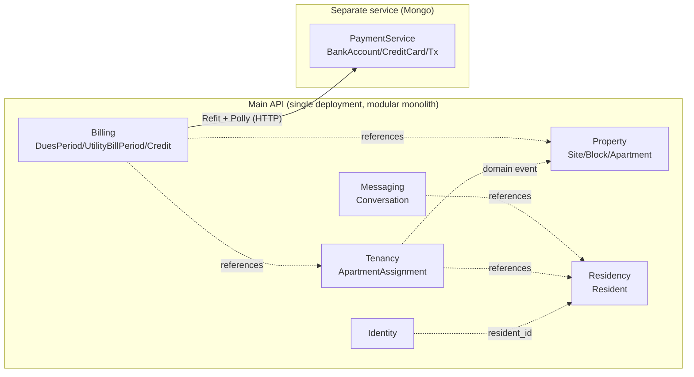
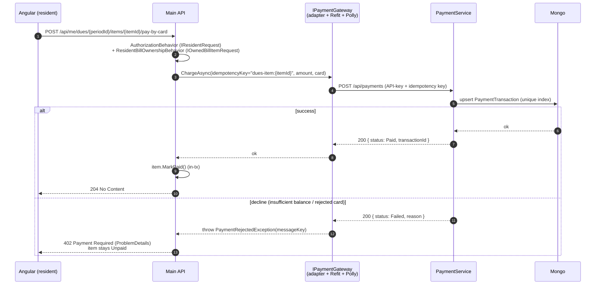
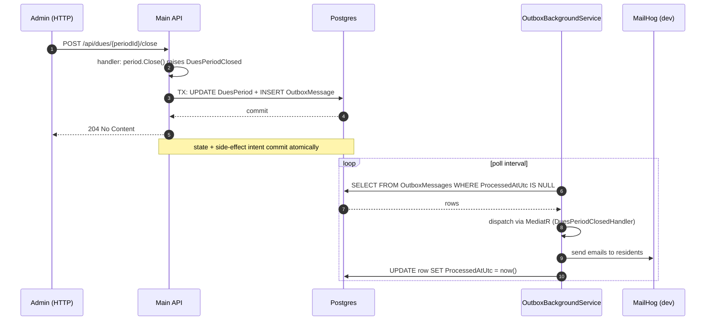

# SiteManagement

> Portfolio project: a modern take on apartment-complex administration built with **DDD + TDD + Clean Architecture**. The admin manages sites, blocks, apartments, and residents and runs monthly dues + utility billing; residents see their own bills and pay them by card. The payment side is an isolated microservice on its own database. Admin ↔ resident chat is real-time over SignalR.

[](https://github.com/mtsmsek/SiteManagement/actions/workflows/ci.yml)
[](LICENSE)
[](https://dotnet.microsoft.com/)

✅ **Weeks 1-6 complete — `v1.0.0`.** Foundation & Deploy → Property / Residency → Tenancy & Billing → **Payment microservice (MongoDB)** → **Resident portal + Messaging + Dashboards (IDOR-safe authorization pipeline)** → **Polish & Ship (real-time SignalR + demo seeder + security headers + rate-limit + 10 ADRs + 90% line coverage).** The six-week plan is in [ROADMAP.md](ROADMAP.md); the day-by-day log lives in the [WEEK-1-2](WEEK-1-2-DETAIL.md) · [WEEK-3](WEEK-3-DETAIL.md) · [WEEK-4](WEEK-4-DETAIL.md) · [WEEK-5](WEEK-5-DETAIL.md) · [WEEK-6](WEEK-6-DETAIL.md) detail files (those are written in Turkish — they were the author's working journal). Architecture decisions: [docs/adr/](docs/adr/).

---

## Demo video

A 2 min 16 s walkthrough of the resident and admin journeys (English narration + on-screen captions, no manual editing — the whole pipeline is in [demo/](demo/), see [demo/README.md](demo/README.md)).

➡️ **[Download `demo-video.mp4` from the v1.0.0 release](https://github.com/mtsmsek/SiteManagement/releases/download/v1.0.0/demo-video.mp4)**

To re-record locally (open-source pipeline: Playwright + piper-tts + ffmpeg-static):

```powershell
.\scripts\record-demo.ps1
```

---

## What's working today

**Infrastructure & cross-cutting:**

- ✅ `docker compose up -d --build` brings up postgres + mongo + mailhog + api + payment-api in a single command
- ✅ ASP.NET Core Identity on PostgreSQL (EF Core 10, migrations auto-applied at startup)
- ✅ JWT bearer auth — `register` / `login` / `refresh` endpoints, refresh token rotation
- ✅ **CQRS-lite** over MediatR with FluentValidation + a fixed pipeline of behaviors:
  - `LoggingBehavior` — structured request/elapsed log per command
  - `ValidationBehavior` — runs FluentValidation before the handler
  - `AuthorizationBehavior` — central role check via the request marker
  - `ResourceOwnershipBehavior` — owner check for `/api/me/*` items
  - `TransactionBehavior` — wraps every command in a DB transaction
  - `ExceptionTranslationBehavior` — Domain → Application translation in one place
- ✅ **Three-tier exception architecture** + RFC 7807 ProblemDetails responses
- ✅ **Backend localization** (tr-TR default + en-US) — `Accept-Language` chooses the message bundle; FluentValidation placeholders substitute correctly
- ✅ Serilog + structured request logging
- ✅ Scalar API docs UI (`/scalar/v1`) with the Bearer auth panel
- ✅ Health checks (Postgres probe + Payment service downstream probe)
- ✅ Security headers + rate limiter (login 5/min IP-keyed, pay-by-card 10/min user-keyed)
- ✅ GitHub Actions CI (build + test + coverage HTML, Postgres service container)

**Domain (W2-W3):**

- ✅ **Property / Residency / Tenancy / Billing** bounded contexts — rich aggregates (TDD), private setters, value objects (TcNo with checksum, Money, BillingMonth, …)
- ✅ Site → Block → Apartment, resident registration, owner/tenant assignment (historised)
- ✅ **Dues + utility periods:** open → bulk-distribute → pay → close; per-site debt summary (accrued / collected / outstanding)
- ✅ **Transactional Outbox** — integration events delivered after commit (email etc.); domain events run in-transaction
- ✅ **Soft delete** on the aggregate root (Site only) — archive / restore / permanent purge, global query filter + guardrail test
- ✅ **Audit** — `Created/Modified By + At`, SaveChanges interceptor + `ICurrentUser`
- ✅ Angular 21 admin UI (standalone + signals): sites, residents, billing pages

**Payment microservice (W4):**

- ✅ **Separate solution** (`payment-service/`, `payment-api:8090`) — MongoDB 7, its own Domain / Application / Infrastructure / Api layers (polyglot persistence)
- ✅ **Fake bank:** `BankAccount` + `CreditCard` rich aggregates with Luhn / expiry / balance checks; Mongo unique index for idempotency
- ✅ Main API → PaymentService via **Refit + Polly** (`AddStandardResilienceHandler`) — `IPaymentGateway` port + `PaymentGatewayAdapter` (anti-corruption layer); service-to-service API key
- ✅ **Pay-by-card** (dues + utility items): charge first → mark `Paid` on success; **decline → 402**, line stays `Unpaid` (atomic); deterministic idempotency key makes retries safe
- ✅ **Credit balance (overpayment):** correcting a period's amount down credits the over-paying resident (`ResidentCreditAccount`); the next distribution auto-applies the credit if it fully covers the new item
- ✅ Angular card-payment dialog + animated error snackbar for declines
- ✅ Two-layer E2E: PaymentService on real Mongo + HTTP; main API stubs the gateway with WireMock for the consumer-side contract test

**Resident portal + Messaging + Dashboards (W5):**

- ✅ **Authorization pipeline** — every request declares exactly one role marker (`IAdminRequest` / `IResidentRequest` / `IPublicRequest`); `AuthorizationBehavior` enforces it centrally and an **architecture test** turns "forgot to add a marker" into a build error. Handlers carry zero auth code.
- ✅ **Resident portal** — resident logs in → own dashboard, "my bills", pays own line by card. Token-scoped `/api/me/*` + **resource-ownership pipeline behaviors**; **IDOR** proven by E2E in both directions (403/402, line stays `Unpaid`)
- ✅ **Messaging** — admin ↔ resident threads (`Conversation` aggregate, TDD), per-side unread counts; admin `/api/conversations` + resident `/api/me/conversations`; Angular resident messaging UI
- ✅ **Dashboards** — admin (site / resident counts, accrued / collected, outstanding, credit, collection rate) + resident (outstanding + credit + unread messages); pure read-side projection
- ✅ Angular `/resident/*` area (`residentGuard`, role-based login redirect)

**Polish & Ship (W6):**

- ✅ **Admin messaging UI** (the one W5 carry-over) — two-pane inbox + thread + new-conversation dialog
- ✅ **SignalR real-time messaging** — `MessagingHub` + role-based group join (`messaging:admins`, `messaging:resident:{N}`); JWT bearer query-string handshake; pushes surface the other side's actions in the UI immediately. Push-only — posts still go over HTTP (validation + ownership pipeline stay in the same place)
- ✅ **DemoSeeder** — `Demo:SeedOnStartup=true` populates the DB on first boot with 1 site + 3 residents + welcome emails in MailHog + 1 open dues period (1 paid + 2 unpaid) + 1 admin-opened conversation
- ✅ **Downstream health probe** — main API typed-HttpClient probe on the PaymentService `/health` (2-second timeout); PaymentService exposes its own `/health` too
- ✅ **Security headers** (Production profile) + **rate limit** (login fixed 5/min IP-keyed + pay-by-card sliding 10/min user-keyed); E2E verifies the 429
- ✅ **Coverage harness** — Coverlet + ReportGenerator HTML; **Line 90.2% / Branch 82.3% / Method 84.9%**; CI uploads the report as an artefact + posts the summary to the run page
- ✅ **10 ADRs** ([docs/adr/](docs/adr/)) — DDD/Clean, Rich Domain, Modular Monolith + Payment, Exception-based, CQRS-lite, Authorization Pipeline, Outbox, Soft Delete, Token-Scoped Resident Endpoints, Refit + Polly

---

## Tech stack

| Layer | Choice |
|---|---|
| Runtime | .NET 10 |
| Web framework | ASP.NET Core 10 (controllers, OpenAPI v2) |
| Main DB | PostgreSQL 16 |
| Payment DB | MongoDB 7 _(W4)_ |
| ORM | EF Core 10 |
| Auth | ASP.NET Core Identity + JWT bearer |
| CQRS bus | MediatR 14 |
| Validation | FluentValidation 12 |
| Logging | Serilog (structured + request logging) |
| API docs | Scalar UI (replaces Swashbuckle — compatible with .NET 10 / OpenAPI v2) |
| HTTP client | Refit + Polly _(W4)_ |
| Real-time | ASP.NET Core SignalR _(W6, messaging)_ |
| Localization | `IStringLocalizer` + .resx (tr-TR, en-US) |
| Rate limiting | .NET 10 built-in `AddRateLimiter` _(W6)_ |
| Frontend | Angular 21 (standalone, signals) _(W2)_ |
| UI library | Angular Material 3 _(W2)_ |
| Frontend i18n | ngx-translate _(W2)_ + key-parity guardrail _(W6)_ |
| Coverage | Coverlet + ReportGenerator _(W6)_ |
| Test | xUnit, FluentAssertions, NSubstitute, Testcontainers, WireMock |
| Container | Docker + Compose v2 |
| CI | GitHub Actions |
| Deploy | None on purpose (demo-only) — see [Demo mode](#demo-mode) |

---

## Architecture overview

```
SiteManagement.Domain         ← framework-free; aggregates, value objects, domain events
       ▲
SiteManagement.Application    ← MediatR command/query handlers, FluentValidation, ports (interfaces)
       ▲
SiteManagement.Infrastructure ← EF Core, Identity, JWT token service, repository implementations
       ▲
SiteManagement.Api            ← controllers, middleware, OpenAPI / Scalar, Serilog, Program.cs
```

- **Domain** has zero external dependencies. BCL only. Aggregate roots own their invariants; setters are `private`.
- **Application** sees only the ports it needs (`ITokenService`, `IUserAuthService`, `IRefreshTokenStore`, `IPaymentGateway`, …) — no Identity / JWT / EF Core references. Every use case is a command/query + handler + validator.
- **Infrastructure** holds the concrete port implementations + EF Core mappings + Identity wiring.
- **Api** is thin — controllers call `ISender.Send(command)`; no business logic.

The rationale behind each decision lives next door in [docs/adr/](docs/adr/) (MADR format).

### Bounded context map



### Sequence: pay-by-card (FE → API → PaymentService)



### Sequence: outbox after-commit delivery



> SignalR pushes are **outside this flow**: real-time UI notifications are ephemeral (lost when the client is disconnected), while the Outbox is durable (delivered eventually, exactly-once-ish). Two different guarantee tiers — [ADR 0007](docs/adr/0007-outbox-pattern-for-integration-events.md) walks through the split.

---

## Local setup

> First time on a new machine: **[docs/SETUP-MACHINE.md](docs/SETUP-MACHINE.md)** — .NET SDK, Docker Desktop, WSL2, git/gh, optional tooling.

### Prerequisites

- [.NET 10 SDK](https://dotnet.microsoft.com/download)
- [Docker Desktop](https://www.docker.com/products/docker-desktop/) (Compose v2) + WSL2 (Windows)
- _Recommended editor:_ JetBrains Rider / Visual Studio 2022 17.13+ / VS Code + C# Dev Kit

### Quickstart

```powershell
git clone https://github.com/mtsmsek/SiteManagement.git
cd SiteManagement

# 1) Create the env file (the defaults are fine for local dev)
Copy-Item .env.example .env

# 2) Bring the whole stack up (postgres + mongo + mailhog + api + payment-api)
docker compose up -d --build

# 3) Health endpoint
curl http://localhost:8080/health
# -> Healthy
```

### Auth smoke

> Security: **there is no public register endpoint.** The first admin is seeded at startup from the `ADMIN_BOOTSTRAP_*` values in `.env`. Every subsequent user is created through authenticated admin endpoints.

```powershell
$base = "http://localhost:8080"

# Log in as the bootstrap admin (ADMIN_BOOTSTRAP_EMAIL / PASSWORD in .env)
$body = @{ email = "admin@sitemanagement.local"; password = "Str0ng-P@ss-Dev" } | ConvertTo-Json
$tokens = Invoke-RestMethod -Uri "$base/api/auth/login" -Method Post -Body $body -ContentType "application/json"
$headers = @{ Authorization = "Bearer $($tokens.accessToken)" }

# Admin creates a site
$site = @{ name = "Lavender Heights"; address = "Cumhuriyet Mah." } | ConvertTo-Json
Invoke-RestMethod -Uri "$base/api/sites" -Method Post -Body $site -ContentType "application/json" -Headers $headers

# Localization: an en-US header returns the English message bundle
Invoke-WebRequest -Uri "$base/api/auth/login" -Method Post `
    -Body (@{ email = ""; password = "" } | ConvertTo-Json) -ContentType "application/json" `
    -Headers @{ "Accept-Language" = "en-US" } -SkipHttpErrorCheck | Select-Object -ExpandProperty Content
```

### Frontend (Angular admin + resident UI)

```powershell
cd web
npm install          # one-off
npm start            # ng serve -> http://localhost:4200
```

- **Stack:** Angular 21 (standalone, signals, zoneless), Angular Material 3, ngx-translate (tr / en)
- **Layout:** feature-based + `core/` (auth service, guards, interceptors) + `shared/` + `layouts/`
- **Auth:** JWT in localStorage, functional token interceptor (Bearer + 401 refresh), `adminGuard` / `residentGuard`
- Login: bootstrap admin credentials → `/admin/dashboard`
- API base URL: `web/src/environments/environment.ts` (`http://localhost:8080`)
- Backend CORS dev policy is open to `http://localhost:4200`

### Running services

| Service | URL / Port | Notes |
|---|---|---|
| Main API | http://localhost:8080 | `/health` includes Postgres + Payment downstream probes |
| Payment API | http://localhost:8090 | Separate microservice on Mongo; `/health` (Mongo ping) |
| Scalar API docs | http://localhost:8080/scalar/v1 | Interactive UI over OpenAPI (dev only) |
| OpenAPI JSON | http://localhost:8080/openapi/v1.json | Import into Postman / Insomnia / Bruno |
| MailHog UI | http://localhost:8025 | Dev SMTP catcher |
| PostgreSQL | `localhost:5432` | Main DB — DBeaver / pgAdmin friendly |
| MongoDB | `localhost:27017` | PaymentService DB _(active since W4)_ |

### Run the databases in Docker but the API locally

```powershell
docker compose up -d postgres mongo mailhog
dotnet run --project src/SiteManagement.Api
# -> http://localhost:5200
```

### Tests

There are two solutions, so plain `dotnet test` fails ("two `.slnx` files found"); always pass one explicitly:

```powershell
dotnet test SiteManagement.slnx -m:1                       # main API (Domain / App / Arch / E2E)
dotnet test payment-service/PaymentService.slnx -m:1       # payment microservice (Domain / Arch / E2E)

cd web; npm test                                           # Angular (Vitest)
```

> **E2E needs Docker** (Testcontainers). **Warning:** running E2E while the local `docker compose` stack is up can truncate the compose database (including the bootstrap admin + seeded data); `docker compose restart api` re-seeds the admin afterwards.

### Coverage report

```powershell
.\scripts\coverage.ps1
# -> coverage/index.html (Coverlet + ReportGenerator HTML)
```

### Bring the stack down

```powershell
docker compose down              # stop containers, keep volumes
docker compose down --volumes    # stop + wipe volumes (DB reset)
```

---

## Demo mode

A single command brings the stack up populated with demo data:

```powershell
Copy-Item .env.example .env   # DEMO_SEED_ON_STARTUP=true is already on
docker compose up -d --build
```

You get the bootstrap admin (`admin@sitemanagement.local` / `Str0ng-P@ss-Dev`) + 1 site + 3 residents + 1 open dues period (1 paid + 2 unpaid lines) + 1 admin-opened conversation, with the welcome emails sitting in MailHog. Use the password from the welcome email to log in as a resident. The PaymentService seeder ships the Luhn-valid test card `4242 4242 4242 4242` (CVV `123`, expiry `12/2030`) with a funded fake bank account, so pay-by-card just works.

### Production deploy

There is **no live URL** — that's a deliberate scope decision (the cost + maintenance overhead of hosting beat the portfolio payoff for a single-developer showcase). The platform helpers (`PortBindingExtensions.UsePlatformPort`, `DatabaseUrlExtensions.UsePlatformDatabaseUrl`) are in place, so swapping in Railway / Render / Fly.io would be a configuration change, not a rewrite. Step-by-step guide: **[docs/DEPLOY-RAILWAY.md](docs/DEPLOY-RAILWAY.md)**.

### Showing this to someone live

Walking a hiring manager / interviewer / friend through the project? Use the **[Live Demo Runbook](docs/LIVE-DEMO-RUNBOOK.md)** — pre-flight, copy-paste credentials, scene-by-scene script with the one or two sentences to say on each page, a Q&A table mapping technical questions straight to the ADR that answers them, fallback if something breaks live, and a one-page cheat sheet.

---

## Known limitations (honest portfolio)

Things this project deliberately leaves out of scope — none of these are forgotten, they were all conscious calls:

- **No resident self-registration** — a resident account can only be created by an authenticated admin calling `POST /api/residents`. The lack of a public register endpoint is the security posture, not an oversight.
- **In-memory refresh tokens, no family invalidation** — `InMemoryRefreshTokenStore` drops tokens on restart. Rotation + reuse-detection are in place, but a "blow up the whole family on any reuse" tier is not. Production move: EF-backed store + family column.
- **JWT lifetime is 60 min** — silent refresh works; tightening to 15 min would inflate refresh traffic and worsen the dev loop with no measurable defence gain. Production tweak is one config line.
- **Credit balance partial settlement is off** — overpayment credit auto-applies only when it fully covers the next line; partial application (e.g. 300 of a 400 line) needs a `creditApplied` state on the line item (domain + migration + UI). Consciously deferred.
- **No file attachments in messaging** — text-only threads with per-side unread. Storage strategy (S3 / disk / blob) is its own decision; marginal value for the showcase flow.
- **No in-app notification centre** — notification today is the welcome email through the Outbox; no in-app bell + history.
- **No audit-log UI** — `AuditableEntity` records the data, the admin page does not exist yet.
- **No API versioning** — the route prefix is plain `/api/`.
- **SignalR single-instance** — no Redis backplane; horizontal scale would need one (Redis / Azure SignalR).
- **No CSP header** — Angular ships from a separate origin and Scalar uses inline scripts in dev; CSP belongs to the production host that serves the bundle.
- **Mobile responsive sweep, not mobile-first** — `BreakpointObserver` flips the sidenav to `over` mode with a hamburger on phones, but the experience is tuned for tablet-and-up rather than a native-feeling phone app.

---

## CI & test strategy

GitHub Actions ([`.github/workflows/ci.yml`](.github/workflows/ci.yml)):

- Runs on every push to `main` and every PR
- Sets up .NET 10 SDK, starts a Postgres 16 service container
- `dotnet restore` → `dotnet build --configuration Release` (warnings = errors, enforced in the csproj) → `dotnet test` with `coverlet.runsettings`
- Renders the HTML coverage report through ReportGenerator and uploads it as the `coverage-html` artefact; posts the text summary to the workflow run page

Test projects:

| Project | Purpose |
|---|---|
| `SiteManagement.Domain.Tests` | Domain unit tests — aggregate invariants, value objects (TDD) |
| `SiteManagement.Application.Tests` | Handler + pipeline-behavior unit tests (repos mocked with NSubstitute) |
| `SiteManagement.E2E.Tests` | Testcontainers + WebApplicationFactory — full HTTP flows; pay-by-card uses a WireMock stub |
| **`SiteManagement.ArchitectureTests`** | NetArchTest enforces layer dependency direction + CQRS naming conventions + soft-delete / integration-event guardrails + resource-key parity |
| `PaymentService.Domain.Tests` | PaymentService domain unit tests (bank / card / transaction, money rounding) |
| `PaymentService.E2E.Tests` | PaymentService end-to-end over real Mongo (Testcontainer) + HTTP |
| `web` (Vitest) | Angular store / interceptor / component unit tests |

The architecture tests are the long-term guarantor of the codebase's health:

- **Layer dependency:** Domain is BCL-only, Application has no EF / no ASP.NET, Infrastructure has no Api reference.
- **CQRS naming:** every `IRequest<>` ends in `Command` or `Query`; every command has both a handler **and** a validator; handlers are `sealed`.
- **Authorization conventions:** every request implements exactly one of `IAdminRequest` / `IResidentRequest` / `IPublicRequest` — forgetting fails the build.
- **Resource integrity:** every `ErrorMessageKeys` / `ValidationMessages` constant has a matching entry in **both** the tr and en `.resx` files; the two files cannot drift.

---

## License

MIT — see [LICENSE](LICENSE).
