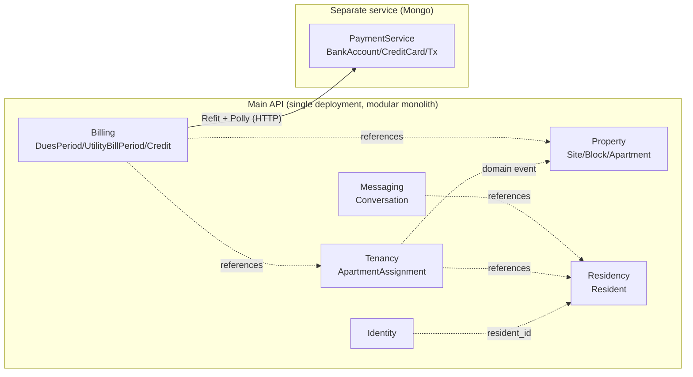
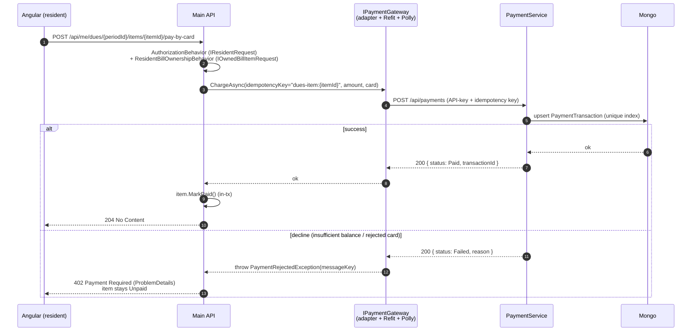
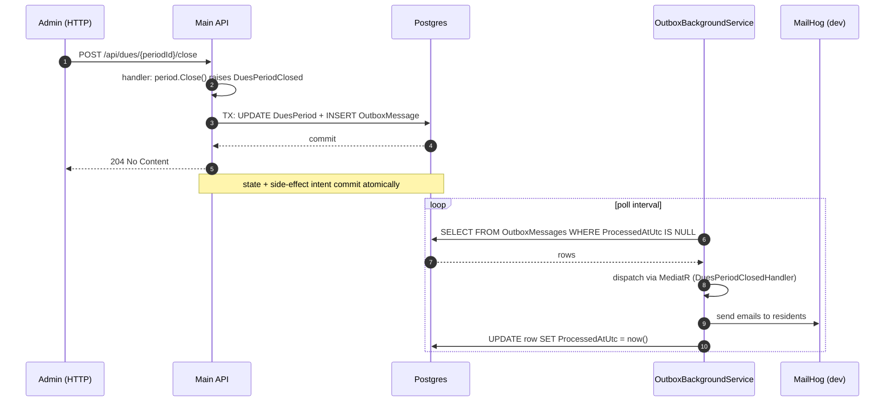

# SiteManagement

> Patika bitirme projesinin **DDD + TDD + Clean Architecture** ile modern bir yorumu. Site (apartman kompleksi) yönetim sistemi: admin daire/blok yönetimi, sakin kaydı, aidat & fatura dağıtımı; resident kendi borçlarını görüp kredi kartıyla öder. Ödeme tarafı ayrı bir microservice.

[](https://github.com/mtsmsek/SiteManagement/actions/workflows/ci.yml)
[](LICENSE)
[](https://dotnet.microsoft.com/)

✅ **Hafta 1-6 tamam — `v1.0.0`.** Foundation & Deploy → Property/Residency → Tenancy & Billing → **Payment microservice (MongoDB)** → **Resident portal + Messaging + Dashboards (IDOR-safe authz pipeline)** → **Polish & Ship (SignalR real-time + demo seeder + security headers + rate-limit + 10 ADR + 90% line coverage).** [ROADMAP.md](ROADMAP.md) 6 haftalık planı; gün gün ilerleme [WEEK-1-2-DETAIL.md](WEEK-1-2-DETAIL.md) · [WEEK-3-DETAIL.md](WEEK-3-DETAIL.md) · [WEEK-4-DETAIL.md](WEEK-4-DETAIL.md) · [WEEK-5-DETAIL.md](WEEK-5-DETAIL.md) · [WEEK-6-DETAIL.md](WEEK-6-DETAIL.md). Mimari kararlar: [docs/adr/](docs/adr/).

---

## ✅ Bugün ne çalışıyor

- ✅ `docker compose up -d --build` ile postgres + mongo + mailhog + api tek komutta ayağa kalkar
- ✅ ASP.NET Core Identity + PostgreSQL (EF Core 10 migration'ları startup'ta otomatik uygulanır)
- ✅ JWT bearer auth — **register / login / refresh** endpoint'leri, refresh token rotation
- ✅ CQRS-lite (MediatR command/query ayrımı) + FluentValidation + 3 pipeline behavior:
  - `LoggingBehavior` — her command için structured request/elapsed log
  - `ValidationBehavior` — handler çalışmadan önce FluentValidation çalıştırır
  - `ExceptionTranslationBehavior` — Domain → Application exception translation tek noktada
- ✅ **Üç katmanlı exception architecture** + RFC 7807 ProblemDetails responses
- ✅ **Backend localization** (tr-TR default + en-US) — `Accept-Language` header'a göre lokalize mesajlar; FluentValidation placeholder'ları doğru substitue olur
- ✅ Serilog + structured request logging
- ✅ Scalar API docs UI (`/scalar/v1`) — Bearer auth panel ile
- ✅ Health checks (Postgres probe dahil)
- ✅ GitHub Actions CI (build + test, Postgres service container)
- ✅ Railway deploy hazır (PORT + DATABASE_URL platform env'lerini otomatik handle eder)

**Domain & işlevler (W2-W3):**
- ✅ **Property / Residency / Tenancy / Billing** bounded context'leri — rich aggregate'lar (TDD), private setter'lar, value object'ler (TcNo checksum, Money, BillingMonth…)
- ✅ Site → Blok → Daire, sakin kaydı, daireye sahip/kiracı ataması (tarihçeli)
- ✅ **Aidat + fatura dönemleri:** aç → toplu dağıt → öde → kapat; site borç özeti (tahakkuk/tahsil/bakiye)
- ✅ **Transactional Outbox** — integration event'ler commit sonrası teslim (mail vb.); domain event'ler in-transaction
- ✅ **Soft delete** (aggregate-root, Site) — archive / restore / permanent purge, global query filter + guardrail test
- ✅ **Audit** — `Created/Modified By+At`, SaveChanges interceptor + `ICurrentUser`
- ✅ Angular 21 admin UI (standalone + signals): siteler, sakinler, faturalandırma sayfaları

**Payment microservice (W4):**
- ✅ **Ayrı solution** (`payment-service/`, `payment-api:8090`) — MongoDB 7, kendi Domain/App/Infra/Api katmanları (polyglot persistence)
- ✅ **Fake banka:** `BankAccount` + `CreditCard` rich aggregate'lar; Luhn / son-kullanma / bakiye kontrolü; idempotency için Mongo unique index
- ✅ Ana API → PaymentService **Refit + Polly** (`AddStandardResilienceHandler`) — `IPaymentGateway` port + `PaymentGatewayAdapter` (anti-corruption layer); servis-servis API-key
- ✅ **Kartla ödeme** (aidat + fatura kalemi): charge first → başarılıysa `Paid`; **red → 402**, kalem `Unpaid` (atomik); deterministik idempotency key ile retry güvenli
- ✅ **Credit balance (overpayment):** dönem tutarı aşağı düzeltilince fazla ödeyen sakine kredi (`ResidentCreditAccount`); sonraki dağıtımda kalemi **tam karşılıyorsa** otomatik mahsup
- ✅ Angular kart ödeme dialog'u + belirgin animasyonlu hata snackbar'ı
- ✅ İki-katmanlı E2E: PaymentService gerçek Mongo+HTTP; ana API pay-by-card WireMock stub (consumer contract)

**Resident portal + Messaging + Dashboards (W5):**
- ✅ **Authorization pipeline** — her request tam bir rol marker'ı (`IAdminRequest`/`IResidentRequest`/`IPublicRequest`) deklare eder; `AuthorizationBehavior` merkezi dayatır, **arch test** "authz'u unutmak = build hatası" yapar. Handler'larda authz kodu yok.
- ✅ **Resident portal** — sakin login → kendi dashboard'ı, "borçlarım", kendi kalemini kartla öder. Token-scoped `/api/me/*` + **resource-ownership pipeline behavior'ları**; **IDOR** her iki yön E2E ile kanıtlı (403/402, kalem `Unpaid` kalır)
- ✅ **Messaging** — admin ↔ sakin thread'leri (`Conversation` aggregate, TDD), per-side okunmamış sayacı; admin `/api/conversations` + resident `/api/me/conversations`; Angular resident mesajlaşma UI'si
- ✅ **Dashboard'lar** — admin (site/sakin sayısı, tahakkuk/tahsil, açık bakiye, kredi, tahsilat oranı) + resident (açık borç + kredi + okunmamış mesaj); saf read-side projeksiyon
- ✅ Angular `/resident/*` alanı (`residentGuard`, rol bazlı login yönlendirme)

**Polish & Ship (W6):**
- ✅ **Admin messaging UI** (W5 borcu kapandı) — iki panel inbox + thread + yeni konu dialog
- ✅ **SignalR real-time messaging** — `MessagingHub` + role-based group join (`messaging:admins`, `messaging:resident:{N}`); JWT bearer query-string handshake; pushes karşı tarafın eylemini UI'a anında getiriyor. Push-only — gönderme HTTP'den (validation + ownership pipeline'da kalıyor)
- ✅ **DemoSeeder** — `Demo:SeedOnStartup=true` ile clone→up→1 site + 3 sakin + welcome mail'ler + 1 dönem (1 paid + 2 unpaid) + 1 admin-açık conversation hazır
- ✅ **Health check** — ana API'nin downstream PaymentService probe'u (typed HttpClient, 2 sn timeout); PaymentService kendi `/health`'ini de export ediyor
- ✅ **Security headers** (Production) + **rate-limit** (login 5/dk fixed IP-key + pay-by-card 10/dk sliding user-key); E2E ile 429 doğrulandı
- ✅ **Coverage harness** — Coverlet + ReportGenerator HTML; **Line 90.2% / Branch 82.3% / Method 84.9%**; CI artifact + step summary
- ✅ **10 ADR** ([docs/adr/](docs/adr/)) — DDD/Clean, Rich Domain, Modular Monolith, Exception-based, CQRS-lite, Authz Pipeline, Outbox, Soft Delete, Token-Scoped Resident Endpoints, Refit+Polly

---

## Tech Stack

| Katman | Seçim |
|---|---|
| Runtime | .NET 10 |
| Web framework | ASP.NET Core 10 (controllers, OpenAPI v2) |
| Main DB | PostgreSQL 16 |
| Payment DB | MongoDB 7 _(W4)_ |
| ORM | EF Core 10 |
| Auth | ASP.NET Core Identity + JWT bearer |
| CQRS bus | MediatR 14 |
| Validation | FluentValidation 12 |
| Logging | Serilog (structured, request logging) |
| API docs | Scalar UI (Swashbuckle yerine — .NET 10 / OpenApi 2.0 uyumlu) |
| HTTP client | Refit + Polly _(W4)_ |
| Real-time | ASP.NET Core SignalR _(W6, messaging)_ |
| Localization | `IStringLocalizer` + .resx (tr-TR, en-US) |
| Rate limiting | .NET 10 built-in `AddRateLimiter` _(W6)_ |
| Frontend | Angular 21 (standalone, signals) _(W2)_ |
| UI lib | Angular Material 3 _(W2)_ |
| i18n (frontend) | ngx-translate _(W2)_ + i18n parity guardrail _(W6)_ |
| Coverage | Coverlet + ReportGenerator _(W6)_ |
| Test | xUnit, FluentAssertions, NSubstitute, Testcontainers |
| Container | Docker + Compose v2 |
| CI | GitHub Actions |
| Deploy | Railway |

---

## Mimari özeti

```
SiteManagement.Domain        ← framework-free; aggregate'lar, value object'ler, domain event'ler
       ▲
SiteManagement.Application   ← MediatR command/query handler'ları, FluentValidation, port'lar (interface'ler)
       ▲
SiteManagement.Infrastructure ← EF Core, Identity, JWT token service, repository implementations
       ▲
SiteManagement.Api           ← Controller'lar, middleware, OpenAPI/Scalar, Serilog wireup, Program.cs
```

- **Domain** sıfır external bağımlılık. Sadece BCL. Aggregate root'lar invariant'larını kendi içlerinde tutar; setter'lar private.
- **Application** sadece port'ları (`ITokenService`, `IUserAuthService`, `IRefreshTokenStore`) bilir — Identity / JWT / EF Core referansı yok. CQRS-lite ile her use case bir command/query + handler + validator.
- **Infrastructure** port'ların concrete implementation'larını + EF Core mapping + Identity setup'ını barındırır.
- **Api** thin — controller'lar `ISender.Send(command)` çağırır, business logic yoktur.

Detaylı kararlar (rich domain prensipleri, exception translation kuralı, test stratejisi): [ROADMAP.md](ROADMAP.md). Tek tek mimari kararlar: [docs/adr/](docs/adr/).

### Bounded context haritası



### Sequence: pay-by-card (FE → API → PaymentService)



### Sequence: outbox after-commit delivery



> SignalR push'ları **bu akışın dışında**: real-time UI bildirimleri ephemeral (bağlantı yoksa kaybolur), Outbox durable (kayıpsız teslim). İkisi farklı garanti seviyeleri — [ADR 0007](docs/adr/0007-outbox-pattern-for-integration-events.md) ayrımı açıklıyor.

---

## Local Setup

> Sıfırdan kurulum (yeni makinede): **[docs/SETUP-MACHINE.md](docs/SETUP-MACHINE.md)** — .NET SDK, Docker Desktop, WSL2, git/gh, opsiyonel araçlar dahil.

### Gereksinimler

- [.NET 10 SDK](https://dotnet.microsoft.com/download)
- [Docker Desktop](https://www.docker.com/products/docker-desktop/) (Compose v2) + WSL2 (Windows)
- _Önerilen:_ JetBrains Rider / Visual Studio 2022 17.13+ / VS Code + C# Dev Kit

### Hızlı başlangıç

```powershell
git clone https://github.com/mtsmsek/SiteManagement.git
cd SiteManagement

# 1) Env dosyasını oluştur (varsayılan dev credential'larıyla yeterli)
Copy-Item .env.example .env

# 2) Tüm stack'i ayağa kaldır (postgres + mongo + mailhog + api)
docker compose up -d --build

# 3) Health endpoint
curl http://localhost:8080/health
# -> Healthy
```

### Auth smoke

> Güvenlik: **public register endpoint'i yoktur.** İlk admin, startup'ta `.env`'deki `ADMIN_BOOTSTRAP_*` değerlerinden seed edilir. Sonraki kullanıcılar authenticated admin endpoint'leri üzerinden yaratılır.

```powershell
$base = "http://localhost:8080"

# Login as the bootstrap admin (.env'deki ADMIN_BOOTSTRAP_EMAIL/PASSWORD)
$body = @{ email = "admin@sitemanagement.local"; password = "Str0ng-P@ss-Dev" } | ConvertTo-Json
$tokens = Invoke-RestMethod -Uri "$base/api/auth/login" -Method Post -Body $body -ContentType "application/json"
$headers = @{ Authorization = "Bearer $($tokens.accessToken)" }

# Admin creates a site
$site = @{ name = "Lavender Heights"; address = "Cumhuriyet Mah." } | ConvertTo-Json
Invoke-RestMethod -Uri "$base/api/sites" -Method Post -Body $site -ContentType "application/json" -Headers $headers

# Localization: en-US header => İngilizce hata mesajı
Invoke-WebRequest -Uri "$base/api/auth/login" -Method Post `
    -Body (@{ email = ""; password = "" } | ConvertTo-Json) -ContentType "application/json" `
    -Headers @{ "Accept-Language" = "en-US" } -SkipHttpErrorCheck | Select-Object -ExpandProperty Content
```

### Frontend (Angular admin UI)

```powershell
cd web
npm install          # ilk sefer
npm start            # ng serve -> http://localhost:4200
```

- **Stack:** Angular 21 (standalone, signals, zoneless), Angular Material 3, ngx-translate (tr/en)
- **Mimari:** feature-based + `core/` (auth service, guards, interceptors) + `shared/` + `layouts/`
- **Auth:** JWT localStorage, functional token interceptor (Bearer + 401 refresh), `adminGuard`
- Login: bootstrap admin credential'larıyla gir → `/admin/sites`
- API base URL: `web/src/environments/environment.ts` (`http://localhost:8080`)
- Backend CORS dev policy `http://localhost:4200`'e açık

### Çalışan servisler

| Servis | URL / Port | Not |
|---|---|---|
| API | http://localhost:8080 | `/health` (Postgres probe dahil) |
| Payment API | http://localhost:8090 | Ayrı microservice (Mongo); `/health` (Mongo ping) |
| Scalar API docs | http://localhost:8080/scalar/v1 | OpenAPI tabanlı interaktif UI (dev only) |
| OpenAPI JSON | http://localhost:8080/openapi/v1.json | Postman/Insomnia/Bruno import için |
| MailHog UI | http://localhost:8025 | Dev SMTP catcher |
| PostgreSQL | `localhost:5432` | Ana DB — DBeaver/pgAdmin ile bağlan |
| MongoDB | `localhost:27017` | PaymentService DB _(W4'ten beri aktif)_ |

### Sadece DB'leri çalıştır, API'yi local'den koş

```powershell
docker compose up -d postgres mongo mailhog
dotnet run --project src/SiteManagement.Api
# -> http://localhost:5200
```

### Test

İki ayrı solution olduğu için `dotnet test`'i **argümansız çağırma** (iki `.slnx` bulur, hata verir) — solution'ı belirt:

```powershell
dotnet test SiteManagement.slnx -m:1                       # ana API (Domain/App/Arch/E2E)
dotnet test payment-service/PaymentService.slnx -m:1       # payment microservice (Domain/E2E)

cd web; npm test                                           # Angular (Vitest)
```

> **E2E Docker ister** (Testcontainers). **Uyarı:** lokal `docker compose` stack ayaktayken E2E koşmak compose veritabanını sıfırlayabilir (bootstrap admin + domain verisi); sonrasında `docker compose restart api` admin'i yeniden seed eder.

### Stack'i kapat

```powershell
docker compose down              # container'ları kapat, volume'ler durur
docker compose down --volumes    # volume'leri de sil (DB sıfırlanır)
```

---

## Demo modu

Tek komut ile demo veriyle dolu bir kurulum:

```powershell
Copy-Item .env.example .env   # DEMO_SEED_ON_STARTUP=true zaten açık
docker compose up -d --build
```

Bootstrap admin (`admin@sitemanagement.local` / `Str0ng-P@ss-Dev`) + 1 site + 3 sakin + 1 açık aidat dönemi (1 paid + 2 unpaid) + 1 admin-açık conversation + welcome mail'ler MailHog'a düşmüş gelir. Mail'deki şifre ile sakin login olunabilir; pay-by-card için PaymentService kendi seeder'ı `4242 4242 4242 4242` Luhn-geçerli test kartı + 100.000 ₺ bakiyeyi hazırlamıştır.

### Production deploy (yapılmadı — bilinçli karar)

Bu proje **vitrin / portfolio** projesidir; live URL yerine **self-hosted demo + video** tercih edildi (ücret + maintenance overhead'i değer/maliyet oranını bozuyor). Kod tarafında deploy yardımcıları (`PortBindingExtensions.UsePlatformPort`, `DatabaseUrlExtensions.UsePlatformDatabaseUrl`) yerinde — gerçek bir host'a alınmak istenirse Railway / Render / Fly.io ile sorunsuz çalışacak şekilde tasarlandı. Adım adım rehber: **[docs/DEPLOY-RAILWAY.md](docs/DEPLOY-RAILWAY.md)**.

---

## Known limitations (dürüst vitrin)

Vitrin projesinin dürüstçe kapsam dışı bıraktığı parçalar — hiçbiri "unutuldu" değil, hepsi bilinçli scope kararı:

- **Resident self-registration yok** — sakin hesabı yalnız authenticated admin'in `POST /api/residents` çağrısıyla doğar. Public register endpoint'i bilinçli olarak yoktur (güvenlik duruşu).
- **Refresh token in-memory + family invalidation yok** — `InMemoryRefreshTokenStore` restart'ta token'leri kaybeder. Rotation + reuse-detection var, ama compromise → "tüm family revoke" tier'ı yok. Production move: EF-backed store + family kolonu.
- **JWT lifetime 60 dk** — silent refresh devrede; 15 dk'ya darıltma refresh hacmini artırırdı, dev UX'i bozardı. Production'da config bir satır.
- **Credit balance partial settlement yok** — overpayment kredisi sonraki kalemi **tam karşılarsa** otomatik mahsup ediliyor; kısmen karşılarsa kalem `Unpaid` kalıyor (kullanıcı bunu bilinçli ertelendi olarak işaretledi).
- **Mesajda dosya/resim ekleme yok** — text-only thread + per-side unread. Storage (S3 / disk / blob) ayrı bir karar; vitrin akışı için marjinal değer.
- **In-app bildirim merkezi yok** — bildirim Outbox üzerinden email; in-app çan + history yok.
- **Audit log UI yok** — `AuditableEntity` veri tutuyor, admin sayfası eksik.
- **API versiyonlama yok** — `/api/` versiyonsuz.
- **SignalR tek instance** — Redis backplane yok; horizontal scale için backplane (Redis / Azure SignalR) eklenmesi gerekir.
- **CSP header yok** — Angular ayrı origin'den serve ediliyor ve Scalar Dev'de inline scripts kullanıyor; prod host gerçekten bundle'ı sunduğunda yazılır.
- **Mobile responsive smoke geçti, mobile-first UX değil** — `BreakpointObserver` ile sidenav `over` mode + hamburger var; production mobile-app deneyimi yerine "tablet+ optimize" hedefi.

---

## CI & Test stratejisi

GitHub Actions ([`.github/workflows/ci.yml`](.github/workflows/ci.yml)):

- Her `main` push'unda ve PR'da koşar
- .NET 10 SDK kurar, Postgres 16 service container'ı ayağa kaldırır
- `dotnet restore` → `dotnet build --configuration Release` (warnings = errors, csproj'da aktif) → `dotnet test`
- Test sonuçları artifact olarak yüklenir

Test projeleri:

| Proje | Amaç |
|---|---|
| `SiteManagement.Domain.Tests` | Domain unit testleri — aggregate invariant'ları, value object'ler (TDD) |
| `SiteManagement.Application.Tests` | Handler / pipeline behavior unit testleri (repo mock'lı, NSubstitute) |
| `SiteManagement.E2E.Tests` | Testcontainers + WebApplicationFactory — full HTTP akışları; pay-by-card WireMock stub ile |
| **`SiteManagement.ArchitectureTests`** | NetArchTest ile katman bağımlılık koruması + CQRS naming + soft-delete/integration-event guardrail'ları + resource key bütünlüğü |
| `PaymentService.Domain.Tests` | PaymentService domain unit testleri (banka/kart/transaction, Money rounding) |
| `PaymentService.E2E.Tests` | PaymentService'i gerçek Mongo (Testcontainer) + HTTP üzerinde uçtan uca |
| `web` (Vitest) | Angular store / interceptor / component unit testleri |

Architecture testleri proje sağlığının uzun vadeli garantörü:
- **Layer dependency:** Domain BCL-only, Application no-EF / no-ASP.NET, Infrastructure → Api referans yok
- **CQRS naming:** Her `IRequest<>` ya `Command` ya `Query` ile bitiyor; her command için handler **ve** validator var; handler'lar `sealed`
- **Resource integrity:** Her `ErrorMessageKeys` / `ValidationMessages` const'unun **hem tr hem en resx**'te karşılığı var; iki resx **drift yok**

---

## Lisans

MIT — bkz. [LICENSE](LICENSE).
